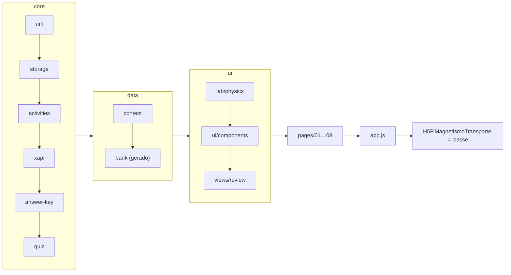
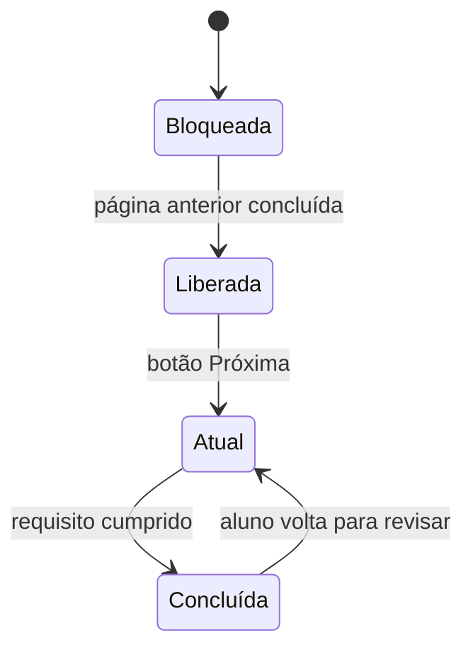

# Arquitetura

O objeto é uma biblioteca H5P própria (`H5P.MagnetismoTransporte`) que monta toda a interface em JavaScript puro, dentro do iframe do H5P. Um único objeto de estado controla as 9 páginas e a aba de revisão. Esse estado é salvo no `localStorage`, e o HTML é gerado a partir dele.

Desde a v2.2, o código é dividido em módulos pequenos, com uma página por arquivo. Não há bundler: cada arquivo é um IIFE que pendura seu módulo no objeto `H5P.MagnetismoTransporte`, e a ordem de carregamento é a lista de `library.json`.

## Módulos e carregamento



| Módulo | Responsabilidade |
| --- | --- |
| `core/util.js` | escape de HTML, formatação, sorteio com semente, hash `cyrb53` e gerador `mulberry32` |
| `core/i18n.js` | idioma da interface (pt-BR / en-US / es-ES): `L(pt, en, es)`, `field()` para os campos `…En`/`…Es` do banco e `payload()` para as explicações lacradas nas três línguas |
| `core/storage.js` | forma do estado, `hydrate()` com lista branca, registro assinado no `localStorage` |
| `core/activities.js` | as 4 atividades avaliativas (rótulo, página, nota máxima, título xAPI) e `TOTAL_MAX`. As chaves e os máximos são espelhados em `portal-perfis/app.py` (`ATIVIDADES`) e nunca se renomeiam |
| `core/xapi.js` | monta o statement "completed" e o `H5P.XAPIEvent` |
| `core/answer-key.js` | abre o gabarito lacrado (ver [seguranca.md](seguranca.md)) |
| `core/quiz.js` | sorteio das questões por aluno e ordem das alternativas |
| `data/content.js` | conteúdo sem segredo: conceitos, revisão, links, cartas da memória |
| `data/params-en.js` | tradução em inglês dos textos do editor (`content.json`) |
| `data/bank.js` | **gerado** por `scripts/gerar-banco.ps1`: questões com respostas lacradas |
| `lab/physics.js` | física do laboratório (funções puras) |
| `ui/components.js` | HTML reutilizável: cabeçalho de página, vídeo, progresso e resumo de quiz |
| `ui/accessibility.js` | VLibras (carregar, abrir, posicionar a janela), painel de audiodescrição e leitura em voz alta (ver [acessibilidade.md](acessibilidade.md)) |
| `views/review.js` | aba "Revisão estendida" |
| `pages/0N-*.js` | uma página cada, no contrato abaixo |
| `app.js` | controlador (navegação, shell, eventos, notas) e a classe H5P pública |

`app.js` é carregado por último. Ele confere se todos os módulos existem, monta as páginas e **substitui** `H5P.MagnetismoTransporte` pela classe do conteúdo, porque o núcleo do H5P instancia `new H5P.<machineName>(params, contentId)`. Só `PAGES` (metadados) e `TOTAL_MAX` são reexpostos; o banco e o gabarito ficam fora do alcance do console.

## Contrato de uma página

```js
(ns.pages = ns.pages || []).push({
  id: 2,                       // posição (1..8), sem buracos
  short: 'Vocabulário',        // rótulo do stepper
  title: 'As palavras do magnetismo',
  unlockHint: '…',             // mostrado ao lado do "Próxima" bloqueado
  task: 'dragWords',           // opcional: atividade avaliativa (libera a próxima com a nota)
  canLeave(app) {},            // opcional: regra própria de liberação (página 3)
  init(app) {},                // opcional: prepara o estado (construtor e "Apagar progresso")
  reset(app) {},               // opcional: "Praticar novamente"
  render(app, section) {},     // reescreve section.innerHTML a partir de app.state
  actions: { 'nome': (app, trigger, event) => {} },  // botões data-action="nome"
  events: { change(app, event) {} }                  // eventos DOM da página atual
});
```

O `app` recebido pelas páginas é o controlador. Ele oferece `state`, `params`, `ui` (estado transitório, não salvo), `saveState()`, `render({ focusSelector })`, `announce()`, `heading()`, `video()` (que já inclui o painel de audiodescrição de `media.<chave>VideoDescription`), `section(id)`, `frame()`, `resize()`, `recordConceptError()`, `completeActivity()`, `rankedConceptErrors()` e `assetPath()`. Nomes de ação repetidos entre páginas derrubam o carregamento com erro.

## Estado e persistência (`core/storage.js`)

- Chave: `<storageKey>:v<SCHEMA_VERSION>:cid-<contentId>`. O `SCHEMA_VERSION` atual é 5.
- O registro salvo é `{ d: "<JSON do estado>", s: "<assinatura>" }`. Se alguém editar o `d` à mão, a assinatura não confere e o registro é descartado (ver [seguranca.md](seguranca.md)).
- `createDefaultState()` define a forma do estado. `hydrate()` reconstrói campo a campo a partir de uma lista branca, e registros corrompidos voltam ao padrão sem quebrar a atividade.
- **Campo novo no estado exige mudança nos dois lugares.** Caso contrário, ele some ao recarregar.
- Subir o `SCHEMA_VERSION` descarta o progresso salvo, sem migração.
- Falhas de armazenamento (janela anônima, cota cheia) não interrompem a atividade: aparece um aviso no topo, e o estado continua em memória.
- Na prévia local (`contentId = developer-preview`) o backend é o `sessionStorage`: cada aba/janela nova sorteia questões novas (um aluno novo), enquanto recarregar na mesma aba mantém o sorteio. No Lumi/LMS é `localStorage`, por dispositivo e navegador.

Principais campos: `language` (`''`, `pt-BR`, `en-US` ou `es-ES`; o botão único "Língua" + globo do topo abre a lista das três línguas, com a bandeira da que está em uso ao lado do rótulo, e re-renderiza tudo sem mexer no progresso), `theme` (`''` = design padrão, ou o id de um tema de `js/ui/themes.js`; aplicado sem re-render e mantido ao apagar o progresso), `currentPage`, `unlockedPage`, `visitedPages`, `videos`, `conceptErrors`, `graded` (primeira nota de cada atividade) e `tasks.*`. O laboratório guarda `count` (quantos ímãs, de 2 a 10, com 2 por padrão) e `angles`, `missions`, `done`, `skipped` (perguntas puladas) e `tries` (tentativas erradas por pergunta, que liberam o Pular); os quizzes guardam `seed`, `questionIds`, `index` e `answers` (pulo = resposta em branco); o vocabulário guarda `placements`, `mistakes` e `skipped`; a memória guarda o baralho como tokens opacos (use `deckIds()` em `05-memory.js`) e `skipped` (índices dos pares pulados); a dissertativa guarda `text`, `submitted`, `attempts` e `evaluated` (ver `js/core/essay.js` — a rubrica lacrada é relida do banco a cada correção, nunca do estado salvo).

## Navegação sequencial



- `canLeavePage(p)` usa, nesta ordem: `page.canLeave(app)` (página 3: `tasks.magnets.done`); `state.graded[page.task]` nas páginas avaliativas (2, 4, 5 e 7), que é permanente; e, nas páginas de leitura (1 e 6), basta estar na página ou já tê-la visitado.
- `refreshUnlocks()` roda dentro de todo `saveState()` e só aumenta `unlockedPage`. Nenhuma página liberada volta a ser bloqueada.
- `showPage()` recusa páginas acima de `unlockedPage`. O stepper do topo é apenas informativo.

## Renderização e eventos

- Cada página é uma `<section>`. O `render()` do módulo reescreve o `innerHTML` a partir do estado; `app.render()` + `updateShell()` atualizam página, stepper, abas e rodapé. Seções escondidas são esvaziadas (`stopSection`), para um vídeo aberto não continuar tocando.
- Um único conjunto de listeners, delegados na raiz: `click` resolve `data-action` no mapa de ações (globais + de todas as páginas); `change`, `keydown`, drag-and-drop e `pointer*` vão para `events` da página atual.
- **Exceção:** no laboratório, `updateScene()` altera o SVG existente durante o arraste (com `requestAnimationFrame`), para não perder a captura do ponteiro. Só o roteiro (`renderGuide`) é re-renderizado quando uma missão muda.
- `resize()` dispara o evento `resize` do H5P, para o iframe acompanhar a altura.
- A aba **Revisão estendida** é uma segunda visão (`app.view`), alternada por `setView()`, que esconde o stepper e o rodapé. Ela abre quando `unlockedPage` chega a 8, ou sempre, com `behaviour.reviewAlwaysOpen`.

## Questões sorteadas

- Cada aluno recebe 4 questões de escolha única (de 72) e 5 de V ou F (de 62). `Quiz.drawQuestions()` embaralha o banco com a semente do aluno e prefere conceitos diferentes. O baralho da memória também nasce de semente aleatória por aluno.
- As alternativas têm ids opacos; `Quiz.orderedOptions()` embaralha a ordem de forma determinística (semente + id da questão), então a ordem se mantém ao recarregar.
- A correção vem sempre do gabarito lacrado. A nota final é recalculada abrindo o lacre com cada resposta salva; o campo `correct` salvo serve só para exibir.
- "Praticar novamente" gera nova semente e novo sorteio. A nota que conta é a da primeira conclusão.
- Regras do pulo (v2.2.1, pedido da equipe): no vocabulário e no laboratório, o botão Pular fica desativado, com o contador "(n/3)", até **3 tentativas erradas** naquele item (`SKIP_AFTER_TRIES` em `js/core/activities.js`; botão comum `UI.skipButton()`). No vocabulário, ele pula a primeira lacuna aberta que já tenha 3 erros (`task.mistakes`); no laboratório, conta `magnets.tries`. O quiz e o V ou F **não têm pulo**: cada questão recebe uma resposta, que vale nota. Respostas puladas em versões anteriores continuam aparecendo como "Questão pulada". O jogo da memória, página com vídeo do YouTube, mantém o `Pular par` sempre disponível. O pulo grava lacuna `skipped` (vocabulário), pergunta `skipped` (laboratório) ou par `skipped` (memória: conta como uma tentativa sem acerto e revela o próximo par ainda não encontrado), vale 0 e soma erro ao conceito para a revisão. A resposta certa só é revelada depois do pulo, com a questão travada. No laboratório, a etapa pulada conta como feita para liberar a página.

## Pontuação, erros e revisão

- 20 pontos no total: vocabulário 5, quiz 4, memória 1 (acertos ÷ tentativas, com decimais), V ou F 5, dissertativa 5. No vocabulário, a nota é o número de acertos (lacunas puladas valem 0).
- Cada erro soma pontos em `conceptErrors[conceitoId]`. Os resultados e a aba de revisão mostram os 3 conceitos com mais erros, com links para a seção correspondente.

## xAPI

- Na primeira conclusão de cada atividade avaliativa, `completeActivity()` envia um `H5P.XAPIEvent` "completed" com a pontuação. Fora do núcleo H5P, usa um objeto equivalente.
- A atividade **não** aceita resultados vindos de fora (`postMessage` / `externalDispatcher`). Até a v2.1 aceitava, e qualquer script na página podia forjar uma nota.

## Laboratório de ímãs (física)

- A quantidade de ímãs é ajustável de 2 a 10 (padrão 4), sempre em pontos equidistantes do centro; o aluno os acrescenta, retira e gira. Com exatamente 4, `Physics.positions()` os põe nos quatro cantos do palco, que é o arranjo original da atividade; nas outras quantidades, ficam equidistentes por ângulo na elipse. Cada ímã é um par de "cargas" magnéticas (N = +1, S = −1), a 40 px do centro, com decaimento 1/r² e um termo de suavização ε = 6 px.
- As linhas de campo são integradas por RK2, com passo de 5 px, a partir de um leque de sementes no polo N.
- A escala é arbitrária: a interface mostra o campo no centro só como Nulo, Fraco, Médio ou Forte. As perguntas tratam de simetria e superposição, que o modelo representa corretamente.
- Ângulos em graus, no sentido horário, com 0° = N para cima. Encaixam de 15 em 15° ao soltar. O alinhamento é detectado com tolerância de 8°, e o campo nulo quando fica abaixo de 8% da referência (`Physics.NULL_PERCENT`).
